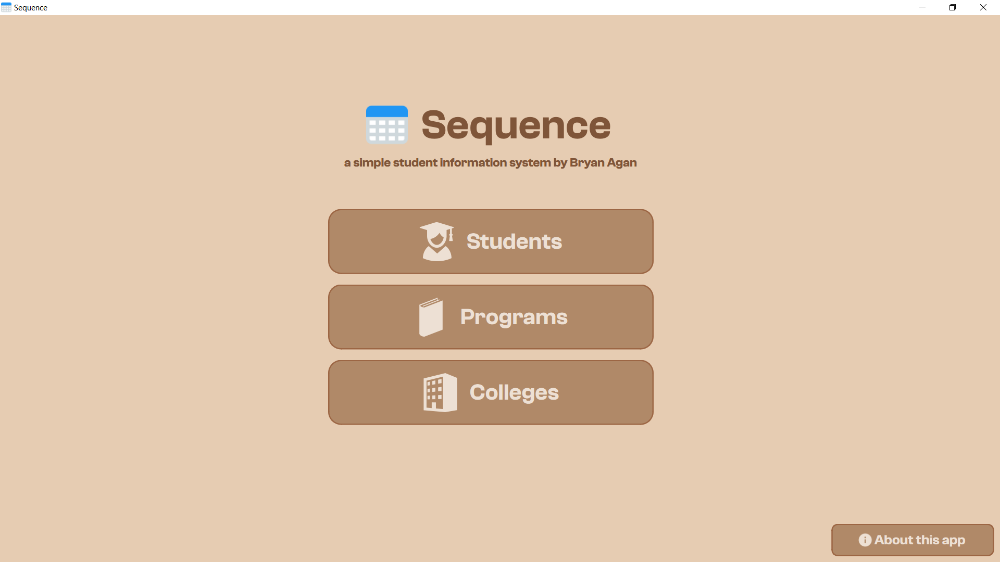
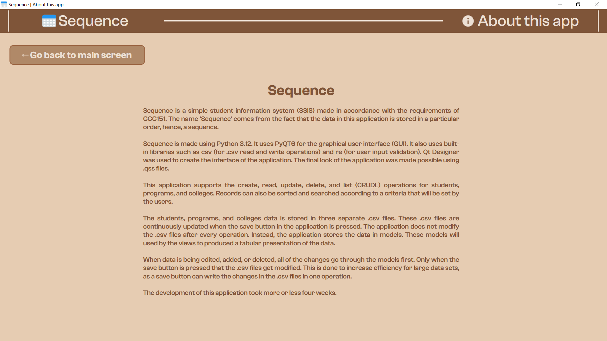
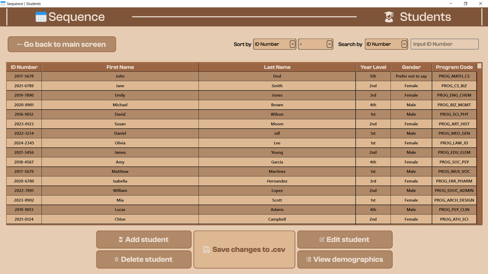
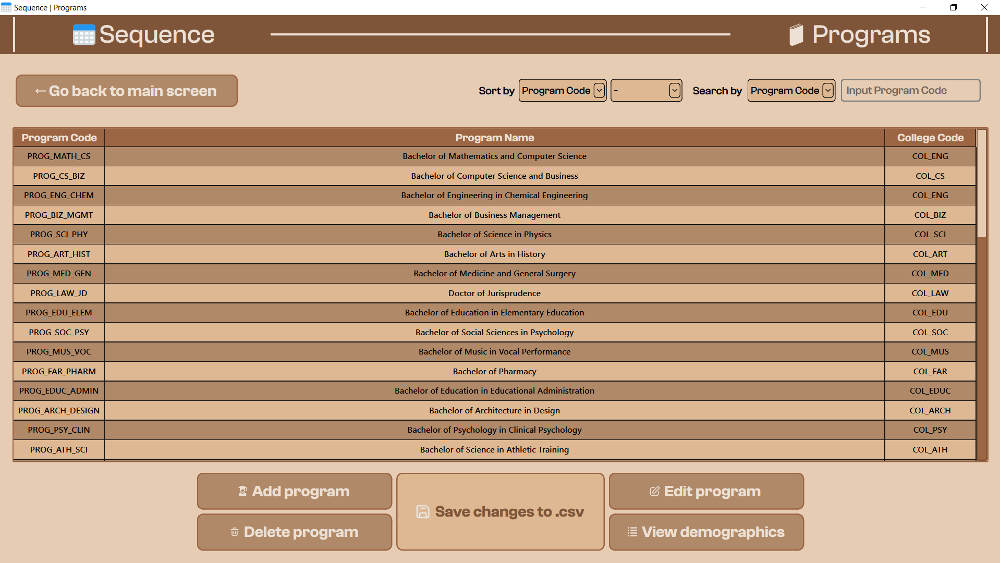
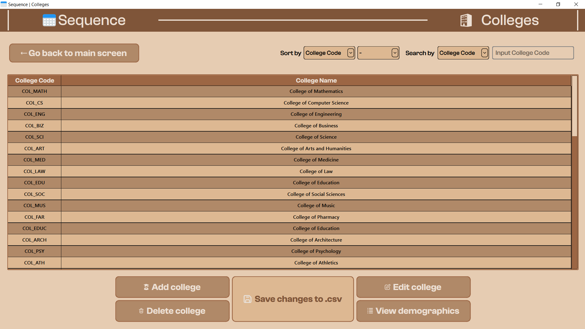

# Sequence, a simple student information system (SSIS)

Sequence is a simple student information system (SSIS) made in accordance with the requirements of CCC151. 

The name 'Sequence' comes from the fact that the data in this application is stored in a particular order, hence, a sequence.

## Requirements
- Python 3.10+
- PyQt6 (Recommended version: 6.8.0+)

## Features

- Create, read, update, delete, and list (CRUDL) operations for students, programs, and colleges
- Search and sort operations
- Full screen mode
- Data storage using lightweight .csv files

## Planned Features

- Undo changes, step by step restoration of the state of the data
- Undo all changes, reset from last save point
- Invalidate a student that has a program that's not in the .csv file
- Invalidate a program that is in a college that's not in the .csv file
- A way to enable/disable table view manipulation
- Delete multiple entries using a checkbox using the delete button 
- Context menu popup upon right click while multiple entities are selected in the table, 
the context menu would show a delete option to edit/delete multiple students
- Search feature in view demographics
- Filter feature in view demographics
- Store data using SQLite/MySQL instead of .csv files
- Add admin and viewer mode; the admin can manipulate the data, while the viewer, can only view the data

## Screenshots










## To run the project on a local machine

Clone the project

```bash
  git clone https://github.com/xbryan25/ccc151-ssis-v1.git
```

Go to the project directory

```bash
  cd ccc151-ssis-v1
```

Create and activate the virtual environment

```bash
  python -m venv ccc151-ssis-v1-venv
  ccc151_ssis_v1_venv\Scripts\activate
```

Once in the virtual environment, install dependencies

```bash
  pip install pyqt6
```

Switch to the working directory

```bash
  cd src
```

Run driver.py

```bash
  python driver.py
```

After running the application, deactivate the virtual environment:

```bash
  deactivate
```

## Feedback

If you have any feedback, please reach out to @xbryan25 using this [email](mailto:bryanaganp25@gmail.com)

## License
This project is licensed under the MIT License.